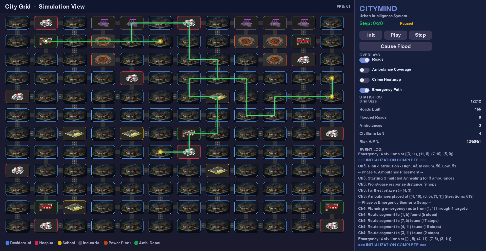

# CityMind: The Intelligent Urban Simulator

**CityMind** is a state-of-the-art urban simulation platform that demonstrates how Artificial Intelligence can solve complex city planning and emergency management problems. From designing layouts to routing ambulances through floods, CityMind orchestrates multiple AI algorithms to create a living, breathing, and self-optimizing city.



---

## Overview

CityMind is built around five core "Challenges," each solving a specific urban planning problem using a different AI technique:

1. **Smart City Layout**: Using rule-based logic (CSP) to place hospitals, schools, and factories perfectly.
2. **Road Network Evolution**: Using a "Genetic Algorithm" to breed the cheapest and most reliable road network.
3. **Emergency Response Strategy**: Using physics-inspired math (Simulated Annealing) to find the best ambulance parking spots.
4. **Real-Time Rescue Routing**: Using the "A* Algorithm" to zoom ambulances through the fastest paths, avoiding crime and floods.
5. **Crime Risk Prediction**: Using Machine Learning (K-Means & KNN) to predict dangerous areas based on city data.

---

## Getting Started

### Prerequisites

- Python 3.8 or higher
- `pip` (Python package manager)

### Installation

1. **Clone or Download** the project folder to your computer.
2. **Open a Terminal** (Command Prompt or PowerShell) in the project directory.
3. **Install Dependencies**:
   ```bash
   pip install -r requirements.txt
   ```

### Running the Simulator

To launch CityMind, simply run:

```bash
python main.py
```

---

## How to Use CityMind

Once the simulator launches, you can interact with the city through the **Control Panel** on the right side of the screen:

### 1. Initialization Phase

- **Regenerate City**: Click this to create a brand new city layout and road network.
- **Run GA (Roads)**: Specifically triggers the evolution of the road network.
- **Run SA (Ambulances)**: Specifically triggers the optimization of ambulance parking spots.

### 2. Emergency Phase

- **Play / Pause**: Start or stop the automated emergency simulation.
- **Step**: Advance the simulation manually by one time-step.
- **Cause Flood**: **The "Destruction" Button!** This will randomly flood a road on the ambulance's current path, forcing the AI to instantly find a new way around.

### 3. Monitoring

- **Event Log**: Watch the bottom-right corner for a live ticker of everything the AI is thinking, from "Successful Rescue" to "Recalculating Route due to Flood."
- **Tooltips**: Hover your mouse over any cell on the grid to see its coordinates, type, accessibility status, and crime risk level.

---

## Project Scope

CityMind was developed as an academic project to showcase the practical application of AI in civil engineering and disaster management.

- **Scale**: A 12x12 grid (adjustable in `config.py`).
- **Complexity**: Handles multi-target rescue missions, dynamic road blocking, and real-time environmental risk assessment.
- **Visuals**: Powered by `pygame` for a premium, high-performance visual experience.

---

## Technologies Used

- **Core Engine**: Python 3.11
- **Graphics**: Pygame
- **Data Math**: NumPy
- **Algorithms**: Genetic Algorithms (GA), Simulated Annealing (SA), A* Search, K-Means Clustering, and K-Nearest Neighbors (KNN).

---

**Built with ❤️ for the Smart Cities of the Future.**
